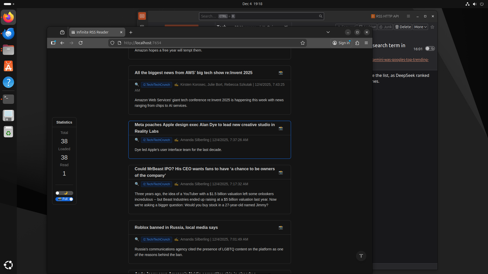
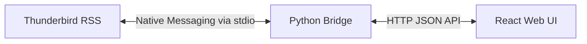

# Infinite RSS Reader for Thunderbird

**Infinite RSS Reader** is a modern, web-based interface for reading your Thunderbird RSS feeds. It transforms your email client's RSS data into a beautiful, infinite-scrolling news stream, similar to Feedly or Google Reader, but powered entirely by your local Thunderbird instance.

While technically a Thunderbird extension, the primary goal of this project is to provide a superior **reading experience**:

- 🚀 **Infinite Scroll**: Seamlessly browse through hundreds of news items without pagination.
- ⚡ **Lightning Fast**: Pre-fetches content and renders instantly.
- 🌗 **Dark Mode**: Auto-detects your system theme for comfortable night reading.
- 📸 **Visual-First**: Optimized layout for media-rich feeds with one-click screenshots.
- ✅ **Auto-Mark as Read**: Items are automatically marked as read as you scroll past them.

## Table of Contents

- [How It Works](#how-it-works)
- [Features](#features)
- [Prerequisites](#prerequisites)
- [Installation](#installation)
- [Usage](#usage)
- [Technical Architecture](#technical-architecture)
- [Troubleshooting](#troubleshooting)
- [Privacy & Security](#privacy--security)

## How It Works

This tool bridges the gap between Thunderbird's robust RSS management and modern web UI standards.

1. **You run Thunderbird** as your RSS aggregator (it handles fetching, storage, and filters).
2. **Infinite RSS Reader** runs a lightweight local server that talks to Thunderbird.
3. **You open `http://localhost:7654`** in your favorite browser (Chrome, Safari, Edge) to read your news in a distraction-free infinite stream.

## Features

- **Infinite Scrolling Stream**: No more clicking "Next" or opening individual item. Just scroll.
- **Syncs with Thunderbird**: Actions are two-way. Scrolling past an item in the browser marks it as read in Thunderbird.
- **Distraction-Free UI**: Clean, responsive interface built with React and Ant Design.
- **Security First**: 
    - Runs entirely on `localhost`.
    - No external servers. 
    - Sanitizes HTML to prevent XSS.
- **Cross-Platform**: Works on Windows, macOS, and Linux.

## Prerequisites

- **Mozilla Thunderbird** (version 91.0 or higher)
- **Python 3** (3.6 or higher)
- **Operating System**: Windows, macOS, or Linux

## Installation

We provide an automated installer to set up the bridge between Thunderbird and the web interface.

### 1. Run the Installer

Open your terminal/command prompt in the project directory:

```bash
git clone https://github.com/AwesomeDog/infinite-rss-reader.git
cd infinite-rss-reader
python install.py
```

The installer will:
1. Configure the native messaging manifest.
2. Install the necessary Thunderbird extension (`.xpi`).
3. Set up the local bridge server.

### 2. Configure Thunderbird

Since this is a developer tool, the extension is unsigned. You need to enable unsigned extensions:

1. Open Thunderbird.
2. Go to **Settings** -> **General** -> **Config Editor** (at the bottom).
3. Search for: `xpinstall.signatures.required`
4. Set it to **`false`** (double-click).
5. Restart Thunderbird.

### 3. Enable the Extension

1. Go to **Tools** -> **Add-ons and Themes**.
2. Find "RSS HTTP API" and ensure it is **Enabled**.

## Usage



1. **Start Thunderbird**: The bridge starts automatically in the background.
2. **Open the Reader**: 
   Go to [http://localhost:7654](http://localhost:7654) in your web browser.
3. **Enjoy Reading**: 
   - Scroll down to auto load more items.
   - Use the **Statistics Panel** on the left to view reading stats and settings.
   - Toggle **Theme (☀️/🌙)** and **Screenshot Mode** (Full/Body) in the panel.
   - Click the **Camera (📸)** icon to copy screenshot to clipboard.
   - Click the **Magnifier (🔍)** icon to view source page.

## Technical Architecture

For developers interested in how this works:



- **Frontend**: React 18, Ant Design (Single HTML file, no build step required).
- **Backend**: Python 3 `http.server` (Standard library only, no `pip install` needed).
- **Communication**: Native Messaging API (Stdio) + REST API.

## Troubleshooting

### "Connection Refused" / Web Interface Not Loading
- Ensure Thunderbird is running.
- Check if the "RSS HTTP API" extension is enabled.

### "No Items Found"
- Ensure you have unread RSS items in Thunderbird.
- Check the logs:
  - **Windows**: `%TEMP%\thunderbird_rss_bridge.log`
  - **macOS/Linux**: `/tmp/thunderbird_rss_bridge.log`

## Privacy & Security

- **Local Only**: This tool **does not** connect to the internet. All data stays on your machine.
- **Sanitization**: All RSS content is sanitized to remove malicious scripts before rendering.
- **Open Source**: You can inspect `app/rss_bridge.py` and `add-on/background.js` to verify no data is exfiltrated.

## License

MIT License. Feel free to fork and modify!
