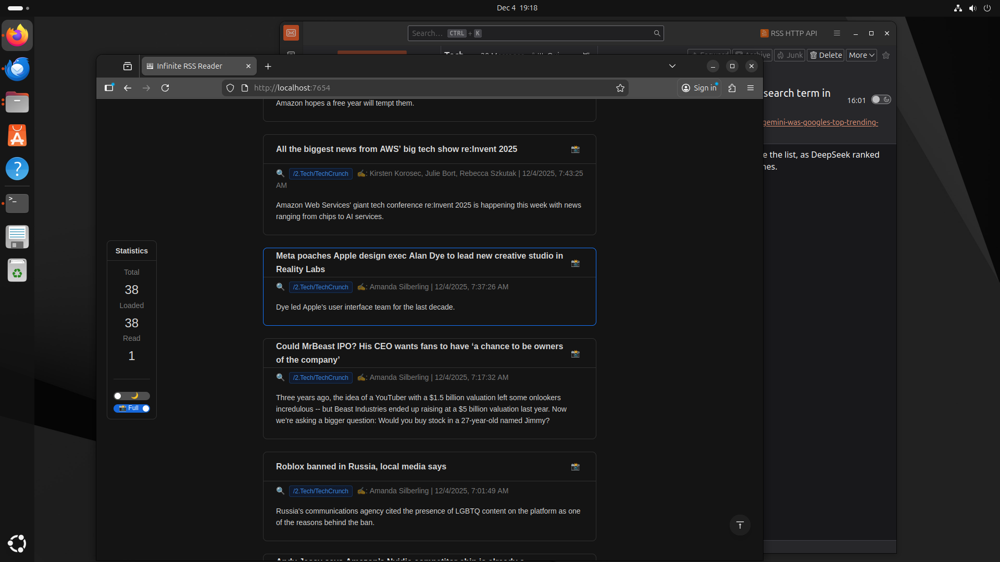
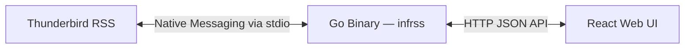

# Infinite RSS Reader for Thunderbird

**Infinite RSS Reader** is a modern, web-based interface for reading your Thunderbird RSS feeds. It transforms your email client's RSS data into a beautiful, infinite-scrolling news stream, similar to Feedly or Google Reader, but powered entirely by your local Thunderbird instance.

While technically a Thunderbird extension, the primary goal of this project is to provide a superior **reading experience**:

- 🚀 **Infinite Scroll**: Seamlessly browse through hundreds of news items without pagination.
- ⚡ **Lightning Fast**: Pre-fetches content and renders instantly.
- 🌗 **Dark Mode**: Auto-detects your system theme for comfortable night reading.
- 📸 **Visual-First**: Optimized layout for media-rich feeds with one-click screenshots.
- ✅ **Auto-Mark as Read**: Items are automatically marked as read with visual distinction as you scroll past them.

## Table of Contents

- [How It Works](#how-it-works)
- [Features](#features)
- [Installation](#installation)
- [Usage](#usage)
- [Updating](#updating)
- [Technical Architecture](#technical-architecture)
- [Building from Source](#building-from-source)
- [Troubleshooting](#troubleshooting)
- [Privacy & Security](#privacy--security)

## How It Works

This tool bridges the gap between Thunderbird's robust RSS management and modern web UI standards.

1. **You run Thunderbird** as your RSS aggregator (it handles fetching, storage, and filters).
2. **Infinite RSS Reader** is a single binary (`infrss`) that acts as both installer and bridge — no dependencies.
3. **You open `http://localhost:7654`** in your favorite browser to read your news in a distraction-free infinite stream.

## Features

- **Infinite Scrolling Stream**: No more clicking "Next" or opening individual items. Just scroll.
- **Syncs with Thunderbird**: Actions are two-way. Scrolling past an item in the browser marks it as read in Thunderbird.
- **Distraction-Free UI**: Clean, responsive interface built with React and Ant Design.
- **Mobile Optimized**: Fully adaptive design ensuring a smooth reading experience on mobile phones and tablets.
- **Multi-Device Ready**: Host on your PC and access via your local network IP to read seamlessly on any device in your home.
- **Single Binary**: Everything — the web UI, the Thunderbird extension, and the native messaging manifest — is embedded in one file. No runtime dependencies.
- **Self-Installing**: Double-click the binary and it sets up everything automatically. No terminal, no `git clone`, no package manager.
- **Auto-Updating Extension**: When the binary is updated, it silently syncs the Thunderbird extension on the next launch.
- **Security First**: 
    - Runs locally on your machine.
    - No external servers. 
    - Sanitizes HTML to prevent XSS.
- **Cross-Platform**: Works on Windows, macOS, and Linux.

## Installation

### Prerequisites

- **Mozilla Thunderbird** (tested with version 147.0.2)
- **Operating System**: Windows, macOS, or Linux

### Option A: Package Manager (Recommended)

**macOS / Linux (Homebrew):**

```bash
brew install AwesomeDog/tap/infrss && infrss
```

**Windows (Winget):**

```bash
winget install AwesomeDog.InfRSS
```

### Option B: Manual Download

Download the binary for your platform from [GitHub Releases](https://github.com/AwesomeDog/infinite-rss-reader/releases):

| Platform | Binary |
|----------|--------|
| macOS (Apple Silicon) | `infrss-macos-arm64` |
| Windows | `infrss-windows.exe` |
| Linux | `infrss-linux-amd64` |

### 2. Run the Installer

**Double-click** the downloaded binary (or run it from the terminal). It will:

1. Copy itself to `~/.local/bin/infrss` (or `infrss.exe` on Windows).
2. Build and install the Thunderbird extension (`.xpi`) to all detected profiles.
3. Register the native messaging manifest so Thunderbird can launch the bridge.

No flags, no configuration — it auto-detects everything.

### 3. Configure Thunderbird

Since the extension is unsigned, you need to allow unsigned extensions:

1. Open Thunderbird.
2. Go to **Settings** → **General** → **Config Editor** (at the bottom).
3. Search for: `xpinstall.signatures.required`
4. Set it to **`false`** (double-click).
5. Restart Thunderbird.

### 3. Enable the Extension

1. Go to **Tools** → **Add-ons and Themes**.
2. Find "RSS HTTP API" and ensure it is **Enabled**.

## Usage



1. **Start Thunderbird**: The bridge starts automatically in the background.
2. **Open the Reader**: 
   Go to [http://localhost:7654](http://localhost:7654) in your web browser.
3. **Enjoy Reading**: 
   - Scroll down to autoload more items.
   - Use the **Statistics Panel** on the left to view reading stats and settings.
   - Toggle **Theme (☀️/🌙)** and **Screenshot Mode** (Full/Body) in the panel.
   - Click the **Camera (📸)** icon to copy screenshot to clipboard.
   - Click the **Magnifier (🔍)** icon to view source page.

## Updating

1. Download the new binary from GitHub Releases.
2. Double-click it.
3. The binary detects the version mismatch, overwrites the installed copy, updates the extension, and clears the startup cache.
4. Restart Thunderbird to pick up the changes.

Alternatively, if installed via a package manager:

```bash
# macOS / Linux
brew upgrade AwesomeDog/tap/infrss && infrss

# Windows
winget upgrade AwesomeDog.InfRSS
```

## Technical Architecture

For developers interested in how this works:


```mermaid
graph LR
    TB[Thunderbird RSS] <-->|Native Messaging via stdio| Go[Go Binary — infrss]
    Go <-->|HTTP JSON API| Web[React Web UI]
```

- **Binary**: Single Go binary with zero third-party dependencies (standard library only).
- **Frontend**: React 18, Ant Design (single HTML file, embedded in binary via `go:embed`).
- **Communication**: Native Messaging API (stdin/stdout) + REST API on port 7654.
- **Two-Mode Design**: The binary auto-detects how it was launched:
  - **No arguments** → Install Mode (self-install workflow).
  - **Extension ID as argument** (launched by Thunderbird) → Bridge Mode (native messaging + HTTP server).

### CLI

```
infrss              Run installer (double-click)
infrss --version    Print version and exit
infrss --help       Print help and exit
```

## Building from Source

Requires Go 1.22+.

```bash
git clone https://github.com/AwesomeDog/infinite-rss-reader.git
cd infinite-rss-reader

# Cross-compile for all platforms:
VERSION=$(git describe --tags --always --dirty)
LDFLAGS="-X main.version=${VERSION}"
GOOS=darwin  GOARCH=arm64 go build -ldflags "${LDFLAGS}" -o bin/infrss-macos-arm64 .
GOOS=windows GOARCH=amd64 go build -ldflags "${LDFLAGS}" -o bin/infrss-windows.exe .
GOOS=linux   GOARCH=amd64 go build -ldflags "${LDFLAGS}" -o bin/infrss-linux-amd64 .

# Release
git tag v0.0.1   # or whatever the next version is
git push && git push --tags
```

## Troubleshooting

### "Connection Refused" / Web Interface Not Loading
- Ensure Thunderbird is running.
- Check if the extension is enabled: **Tools** → **Add-ons and Themes** → find "Infinite RSS Reader".

### "No Items Found"
- Ensure you have unread RSS items in Thunderbird.
- Check the logs at `~/.local/state/infrss/logs/infrss_YYYYMMDD.log`.

## Privacy & Security

- **Local Only**: This tool **does not** connect to the internet. All data stays on your machine.
- **Sanitization**: All RSS content is sanitized to remove malicious scripts before rendering.
- **Zero Dependencies**: The binary is self-contained — no third-party libraries, no network calls, no telemetry.
- **Open Source**: You can inspect the [source code](https://github.com/AwesomeDog/infinite-rss-reader) to verify.

## License

MIT License. Feel free to fork and modify!
