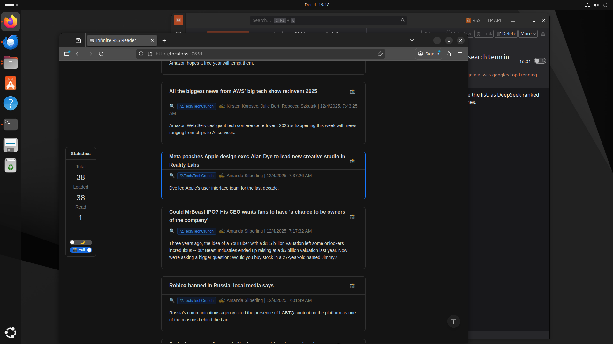
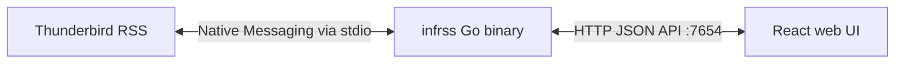
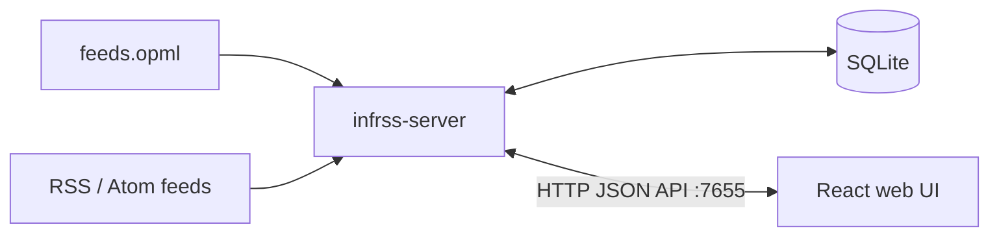

# Infinite RSS Reader — a self-hosted, infinite-scroll RSS reader

[](https://github.com/AwesomeDog/infinite-rss-reader/releases)
[](https://github.com/AwesomeDog/infinite-rss-reader/releases)
[](LICENSE)
[](https://go.dev)
[](#installation)
[](https://github.com/AwesomeDog/infinite-rss-reader/stargazers)

**Infinite RSS Reader** is a modern, web-based **RSS reader** that turns your **Thunderbird** feeds into a beautiful, **infinite-scrolling news stream** — think **Feedly** or **Google Reader**, but 100% local, private and **self-hosted** on your own machine.

It ships as a **single Go binary with zero third-party dependencies**: no Docker, no Node.js, no Python, no database server. Double-click it and start reading at `http://localhost:7654`.

> Prefer no Thunderbird at all? The bundled **`infrss-server`** binary is a standalone **RSS/Atom aggregator** that reads an **OPML** file, fetches feeds itself and stores everything in **SQLite**. See [Standalone mode](#standalone-mode-infrss-server--opml--sqlite).



---

## Table of Contents

- [Why Infinite RSS Reader?](#why-infinite-rss-reader)
- [Features](#features)
- [infrss vs infrss-server: which one do I need?](#infrss-vs-infrss-server-which-one-do-i-need)
- [Installation](#installation)
- [Usage](#usage)
- [Read your RSS feeds on your phone](#read-your-rss-feeds-on-your-phone)
- [Standalone mode (infrss-server + OPML + SQLite)](#standalone-mode-infrss-server--opml--sqlite)
- [Updating](#updating)
- [How it works (architecture)](#how-it-works-architecture)
- [Building from source](#building-from-source)
- [Troubleshooting](#troubleshooting)
- [FAQ](#faq)
- [Privacy & security](#privacy--security)
- [Comparison with other RSS readers](#comparison-with-other-rss-readers)
- [Contributing](#contributing)
- [License](#license)

---

## Why Infinite RSS Reader?

Thunderbird is one of the best **RSS aggregators** ever made — rock-solid fetching, folders, filters, offline storage. Its *reading* UI, however, is still a 2005-era three-pane mail list.

Infinite RSS Reader keeps Thunderbird as the engine and replaces the reading experience with a modern, mobile-friendly web app:

- 🚀 **Infinite scroll** — browse hundreds of news items without pagination or clicking "next".
- ⚡ **Lightning fast** — content is pre-fetched and rendered instantly.
- 🌗 **Dark mode** — auto-detects your system theme for comfortable night reading.
- 📸 **Visual-first** — layout optimized for media-rich feeds, with one-click screenshots to clipboard.
- ✅ **Auto mark as read** — items are marked read (with clear visual distinction) as you scroll past them, and the state **syncs back to Thunderbird**.
- 🔒 **Local & private** — no cloud account, no tracking, no telemetry, no external server.

---

## Features

| | |
|---|---|
| **Infinite scrolling stream** | No "Next" button, no opening items one by one. Just scroll. |
| **Two-way Thunderbird sync** | Scrolling past an item in the browser marks it read in Thunderbird. |
| **Distraction-free UI** | Clean, responsive interface built with React 18 + Ant Design. |
| **Mobile optimized** | Fully adaptive layout for phones and tablets (iOS, Android). |
| **Multi-device / LAN ready** | Host on your PC, read from any device on your home network. |
| **Single binary** | Web UI, Thunderbird extension and native-messaging manifest are all embedded via `go:embed`. |
| **Self-installing** | Double-click the binary — no terminal, no `git clone`, no package manager required. |
| **Auto-updating extension** | Update the binary and the Thunderbird extension is silently re-synced on next launch. |
| **Standalone mode** | `infrss-server`: OPML in, SQLite storage, built-in feed fetcher, same reader UI. |
| **Security first** | Runs locally, sanitizes feed HTML to prevent XSS, no third-party libraries in the binary. |
| **Cross-platform** | Windows, macOS (Apple Silicon), Linux. |
| **Open source** | MIT licensed — fork it, audit it, ship it. |

---

## infrss vs infrss-server: which one do I need?

Both binaries serve the **same** Infinite RSS Reader web UI; they differ only in the backend.

| | **`infrss`** (Thunderbird companion) | **`infrss-server`** (standalone) |
|---|---|---|
| Thunderbird required | ✅ Yes (extension + Native Messaging) | ❌ No |
| Who fetches feeds | Thunderbird | The binary itself |
| Subscription management | Full add / edit / delete in Thunderbird | Read-only from an **OPML** file at startup |
| Storage | Thunderbird profile | **SQLite** |
| Read-state sync | Two-way with Thunderbird | Stored in SQLite |
| Default URL | `http://localhost:7654` | `http://localhost:7655` |
| Best for | **Most users** | Headless/self-contained RSS service |

- **Choose `infrss`** if you already use (or are happy to use) Thunderbird — you get full feed and folder management for free.
- **Choose `infrss-server`** if you want a self-contained RSS service backed by OPML + SQLite. It has no UI or API for adding/editing/deleting feeds; subscriptions are loaded from OPML at startup:

  ```bash
  infrss-server --opml /path/to/feeds.opml
  ```

  See [`docs/server.md`](docs/server.md) for configuration and API details.

---

## Installation

### Prerequisites

- **Mozilla Thunderbird** (tested with 147.0.2; any recent version with MailExtension/WebExtension support should work) — only for `infrss`.
- **OS**: Windows, macOS or Linux.

### 1. Get the binary

**Option A — Package manager (recommended)**

macOS / Linux (Homebrew):

```bash
# Thunderbird companion (infrss)
brew install AwesomeDog/tap/infrss && infrss

# Standalone server (infrss-server)
brew install AwesomeDog/tap/infrss-server
```

Windows (Winget):

```powershell
# Standalone server (infrss-server)
winget install AwesomeDog.infrss-server
```

**Option B — Manual download**

Grab the binary for your platform from [GitHub Releases](https://github.com/AwesomeDog/infinite-rss-reader/releases):

| Platform | Thunderbird companion | Standalone server |
|---|---|---|
| macOS (Apple Silicon) | `infrss-macos-arm64` | `infrss-server-macos-arm64` |
| Windows (x64) | `infrss-windows.exe` | `infrss-server-windows.exe` |
| Linux (x86-64) | `infrss-linux-amd64` | `infrss-server-linux-amd64` |

### 2. Run the self-installer

**Double-click** the downloaded `infrss` binary (or run it from a terminal). It will:

1. Copy itself to `~/.local/bin/infrss` (`infrss.exe` on Windows).
2. Build and install the Thunderbird extension (`.xpi`) into every detected profile.
3. Register the Native Messaging manifest so Thunderbird can launch the bridge.

No flags, no config files — everything is auto-detected.

### 3. Allow unsigned extensions in Thunderbird

The extension is unsigned (it is built locally by the binary), so:

1. Open Thunderbird.
2. **Settings** → **General** → **Config Editor** (bottom of the page).
3. Search for `xpinstall.signatures.required`.
4. Double-click to set it to **`false`**.
5. Restart Thunderbird.

### 4. Enable the extension

1. **Tools** → **Add-ons and Themes**.
2. Find **"Infinite RSS Reader"** (shown as *RSS HTTP API* in older builds) and make sure it is **Enabled**.

### 5. Open the reader

Visit **[http://localhost:7654](http://localhost:7654)** 🎉

---

## Usage

1. **Start Thunderbird** — the bridge starts automatically in the background.
2. **Open the reader** at [http://localhost:7654](http://localhost:7654).
3. **Read:**
    - Scroll down to autoload more items (infinite scroll).
    - Items are automatically **marked as read** as they pass by, and synced to Thunderbird.
    - Use the **Statistics panel** on the left for reading stats and settings.
    - Toggle **Theme (☀️/🌙)** and **Screenshot mode** (Full / Body) in the panel.
    - Click the **camera (📸)** icon to copy a screenshot of an item to your clipboard.
    - Click the **magnifier (🔍)** icon to open the original source page.

### CLI

```
infrss              Run the installer (or double-click the binary)
infrss --version    Print version and exit
infrss --help       Print help and exit
```

---

## Read your RSS feeds on your phone

The reader is a responsive web app, so any device on your LAN can use it:

1. Keep Thunderbird (or `infrss-server`) running on your PC.
2. Find your PC's local IP (e.g. `192.168.1.20`).
3. On your phone or tablet, open `http://192.168.1.20:7654` (or `:7655` for standalone mode).
4. Optional: "Add to Home Screen" for an app-like RSS reader on iOS/Android.

> Nothing leaves your network — there is no cloud relay involved.

---

## Standalone mode (infrss-server + OPML + SQLite)

Prefer a self-hosted RSS server without Thunderbird?

```bash
# Export an OPML file from Feedly / Inoreader / Thunderbird / any reader, then:
infrss-server --opml /path/to/feeds.opml
# Reader available at http://localhost:7655
```

- Fetches RSS and Atom feeds on its own schedule.
- Stores articles and read state in a local **SQLite** database.
- Serves the exact same infinite-scroll UI plus a JSON API.
- Subscriptions come from OPML at startup (no add/edit/delete UI or API).

### Keep your OPML in git

Track `feeds.opml` in a repository and Thunderbird's export makes every commit noisy — feed order follows the folder tree, duplicate subscriptions pile up, and each feed carries an `fz:options` attribute holding its last update timestamp. `--normalize-opml` rewrites an export into a canonical form so diffs only show real changes:

```bash
infrss-server --normalize-opml feeds.opml > feeds.norm.opml && mv feeds.norm.opml feeds.opml
```

Full configuration, flags and API reference: [`docs/server.md`](docs/server.md).

---

## Updating

1. Download the new binary from [GitHub Releases](https://github.com/AwesomeDog/infinite-rss-reader/releases).
2. Double-click it.
3. It detects the version mismatch, overwrites the installed copy, updates the extension and clears the startup cache.
4. Restart Thunderbird.

Via package managers:

```bash
# macOS / Linux
brew upgrade AwesomeDog/tap/infrss && infrss

# Windows
winget upgrade AwesomeDog.infrss-server
```

---

## How it works (architecture)

**Mode 1 — `infrss` (Thunderbird companion)**


```mermaid
graph LR
    TB[Thunderbird RSS] <-->|Native Messaging via stdio| Go[infrss Go binary]
    Go <-->|HTTP JSON API :7654| Web[React web UI]
```

**Mode 2 — `infrss-server` (standalone)**


```mermaid
graph LR
    OPML[feeds.opml] --> Srv[infrss-server]
    Net[RSS / Atom feeds] --> Srv
    Srv <--> DB[(SQLite)]
    Srv <-->|HTTP JSON API :7655| Web[React web UI]
```

- **Binary**: single Go binary, **zero third-party dependencies** (standard library only).
- **Frontend**: React 18 + Ant Design, shipped as one HTML file embedded via `go:embed`.
- **Communication**: Native Messaging (stdin/stdout) + a local REST API.
- **Two-mode launcher**: the `infrss` binary auto-detects how it was started:
    - **No arguments** → *Install mode* (self-install workflow).
    - **Extension ID as argument** (launched by Thunderbird) → *Bridge mode* (native messaging + HTTP server).

---

## Building from source

Requires **Go 1.26+**.

```bash
git clone https://github.com/AwesomeDog/infinite-rss-reader.git
cd infinite-rss-reader

VERSION=$(git describe --tags --always --dirty)
LDFLAGS="-X main.version=${VERSION}"

# infrss (Thunderbird companion)
GOOS=darwin  GOARCH=arm64 go build -ldflags "${LDFLAGS}" -o bin/infrss-macos-arm64 ./cmd/infrss
GOOS=windows GOARCH=amd64 go build -ldflags "${LDFLAGS}" -o bin/infrss-windows.exe  ./cmd/infrss
GOOS=linux   GOARCH=amd64 go build -ldflags "${LDFLAGS}" -o bin/infrss-linux-amd64  ./cmd/infrss

# infrss-server (standalone)
GOOS=darwin  GOARCH=arm64 go build -ldflags "${LDFLAGS}" -o bin/infrss-server-macos-arm64 ./cmd/infrss-server
GOOS=windows GOARCH=amd64 go build -ldflags "${LDFLAGS}" -o bin/infrss-server-windows.exe  ./cmd/infrss-server
GOOS=linux   GOARCH=amd64 go build -ldflags "${LDFLAGS}" -o bin/infrss-server-linux-amd64  ./cmd/infrss-server

# Release
git tag v0.0.1   # next version
git push && git push --tags
```

---

## Troubleshooting

### "Connection refused" / the web interface won't load
- Make sure **Thunderbird is running** (it launches the bridge).
- Check the extension is enabled: **Tools** → **Add-ons and Themes** → **Infinite RSS Reader**.
- Confirm nothing else is using port **7654** (or **7655** for `infrss-server`).

### "No items found"
- Make sure you actually have **unread** RSS items in Thunderbird.
- Check the logs: `~/.local/state/infrss/logs/infrss_YYYYMMDD.log`.

### The extension disappears or shows as unsupported
- Verify `xpinstall.signatures.required` is still `false` in **Config Editor**.
- Re-run the binary once to reinstall the extension, then restart Thunderbird.

---

## FAQ

**Is this a Feedly or Google Reader alternative?**
Yes — it gives you the same infinite-scroll reading experience, but self-hosted on your own machine with no account, no paywall and no tracking.

**Can I use it without Thunderbird?**
Yes. Use `infrss-server` with an OPML file; it fetches feeds itself and stores them in SQLite.

**Does it work on iPhone / Android?**
Yes. The UI is fully responsive — open your PC's LAN address in mobile Safari/Chrome and optionally add it to your home screen.

**Do I need Docker, Node.js, Python or a database server?**
No. It's one static Go binary with the web UI embedded. `infrss-server` uses an embedded SQLite database file.

**Which Thunderbird versions are supported?**
Tested with Thunderbird 147.0.2; recent versions supporting MailExtensions should work.

**Can I import feeds from Feedly / Inoreader / NewsBlur?**
Yes — export OPML from your old reader, then either import it into Thunderbird (for `infrss`) or pass it to `infrss-server --opml`.

**Does it sync read/unread state?**
Yes. In `infrss` mode, read state is written back to Thunderbird; in standalone mode it's stored in SQLite.

**Is it free and open source?**
Yes, MIT licensed.

---

## Privacy & security

- **Local only** — `infrss` never talks to the internet; Thunderbird does all the fetching. `infrss-server` only contacts the feed URLs listed in your OPML.
- **No accounts, no telemetry, no analytics** — nothing is phoned home, ever.
- **HTML sanitization** — all feed content is sanitized to strip scripts and prevent XSS before rendering.
- **Zero dependencies** — no third-party Go libraries in the binary; a small attack surface you can actually audit.
- **Open source** — read the [source code](https://github.com/AwesomeDog/infinite-rss-reader) and verify it yourself.

---

## Comparison with other RSS readers

| | Infinite RSS Reader | Thunderbird built-in | Feedly / Inoreader | FreshRSS / Miniflux |
|---|---|---|---|---|
| Hosting | Local / self-hosted | Local | Cloud (account required) | Self-hosted (server) |
| Infinite scroll stream | ✅ | ❌ | ✅ | Partial |
| Setup | Double-click one binary | Built in | Sign up | Web server / DB / Docker |
| Runtime dependencies | None | None | — | PHP or Go + DB |
| Mobile web UI | ✅ | ❌ | ✅ | ✅ |
| Feed management UI | Via Thunderbird | ✅ | ✅ | ✅ |
| Cost / tracking | Free, no tracking | Free | Freemium, cloud-hosted | Free |

*Great projects, different trade-offs — Infinite RSS Reader is aimed at people who want a modern reading UI with zero infrastructure.*

---

## Contributing

Issues, feature requests and pull requests are welcome. If Infinite RSS Reader improved your daily reading, please ⭐ **star the repo** — it genuinely helps others discover it.

## License

[MIT](LICENSE). Fork it, modify it, ship it.

---

### 中文简介

**Infinite RSS Reader** 是一个本地、注重隐私的 **RSS 阅读器**：它把 **Thunderbird** 中的 RSS 订阅变成现代化的**无限滚动**信息流（类似 Feedly / Google Reader），支持深色模式、移动端自适应、滚动自动标记已读并回写 Thunderbird。整个程序是**一个零依赖的 Go 单文件二进制**，双击即用；也可用 `infrss-server` 以 **OPML + SQLite** 的方式独立运行，无需 Thunderbird。

---

<sub>Keywords: self-hosted RSS reader, infinite scroll RSS reader, Thunderbird RSS extension, Thunderbird add-on, Feedly alternative, Google Reader alternative, open source feed reader, RSS aggregator, Atom reader, OPML reader, SQLite RSS server, local-first news reader, privacy-friendly RSS, Go single binary, Windows / macOS / Linux RSS reader, 无限滚动 RSS 阅读器, 自建 RSS 阅读器</sub>
